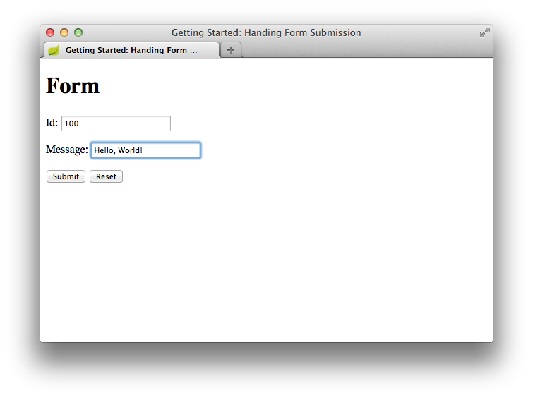
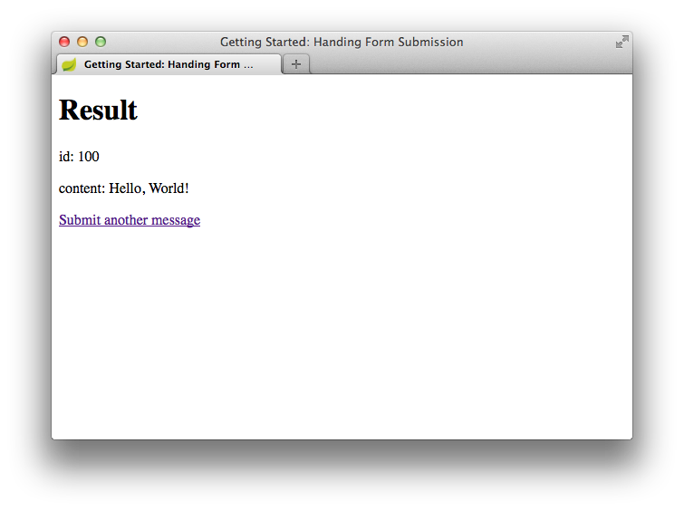

# Spring app with a web form

### About
A simple application, that handles a form page and presents
the input form data on another page.

### Techstack
* Java 11
* Spring Boot : 2.4.4
* Thymeleaf 
* Maven Wrapper
* Spring Initializer : https://start.spring.io/
* Tomcat

### Usage
```sh
./mvnw spring-boot:run
```

The service is active then on : http://localhost:8080/greeting






---

based on:

* https://spring.io/guides/gs/handling-form-submission/
* https://start.spring.io/